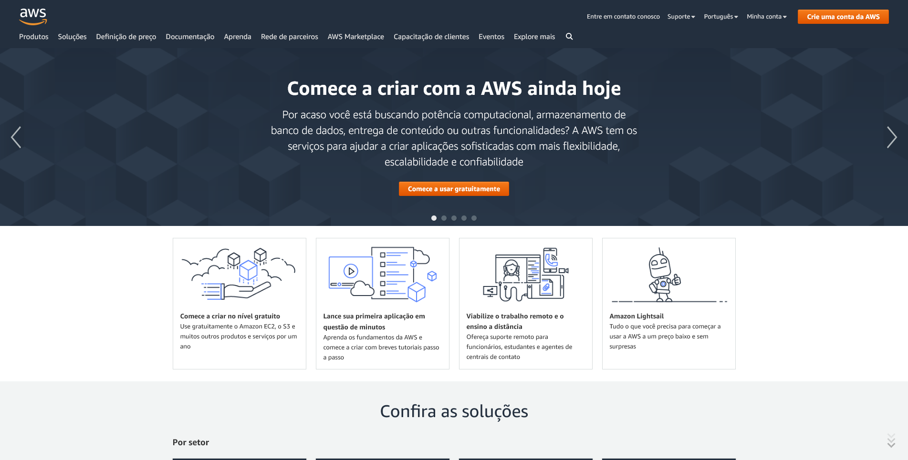
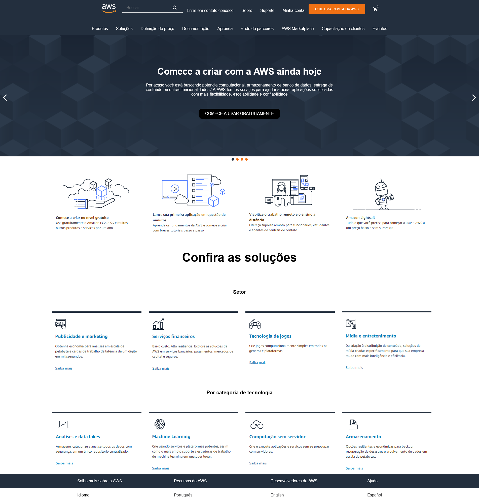
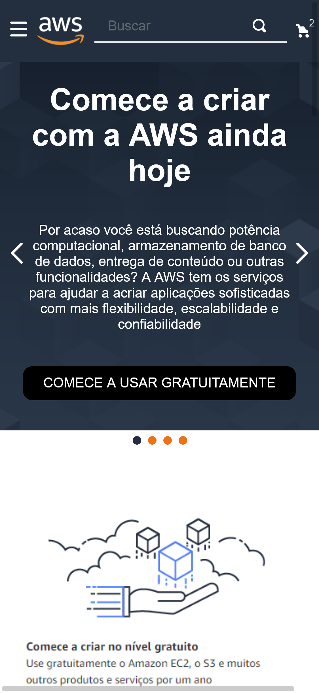
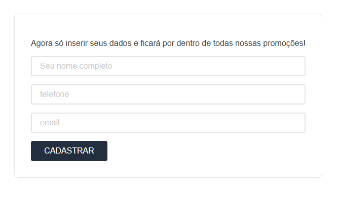
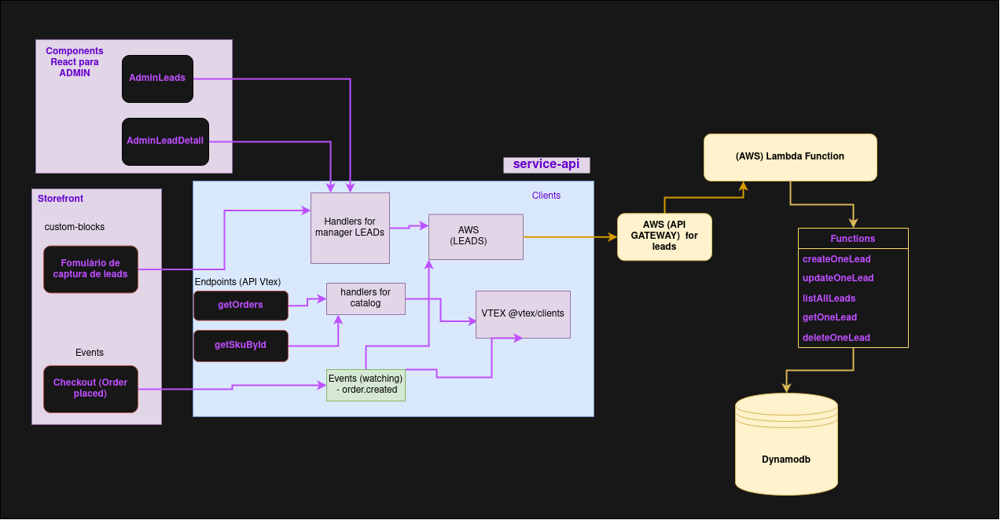

## Repósitorio de arquivos do projeto de desafio #3 do programa Hiring Coders

#### Página base do serviço Amazon AWS

Para o correto funcionamento desse repositório utilize `vtex link` estando na raiz de desafioUpMedal quanto na raiz de componenteReactLeads.

#### Visão geral do projeto

Cada pasta contém um arquivo `readme` mostrando a aparência geral em detalhes.

Nossa tentativa de reproduzir a aparência deu o seguinte resultado no desktop:

A versão móvel ficou assim:

Cadastramos as "leads" em uma página acessada através de um link dentro de um banner na página principal. Após o preenchimento do formulário, será cadastrado no banco de dados para futuramente checarmos se o interessado virou um cliente (vide fluxo presente no diagrama abaixo).

 

