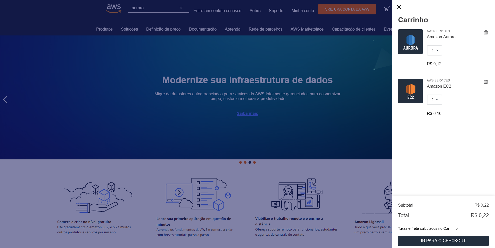
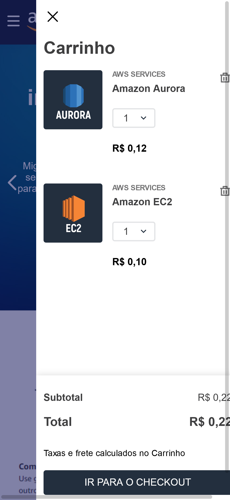
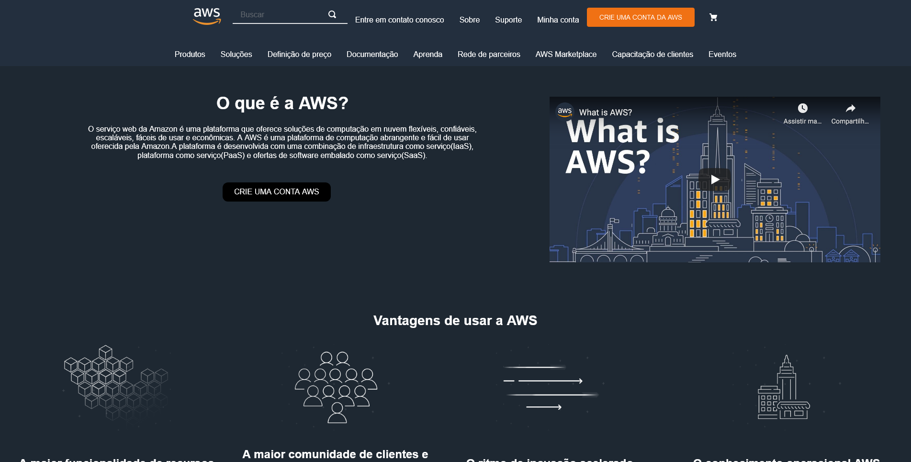
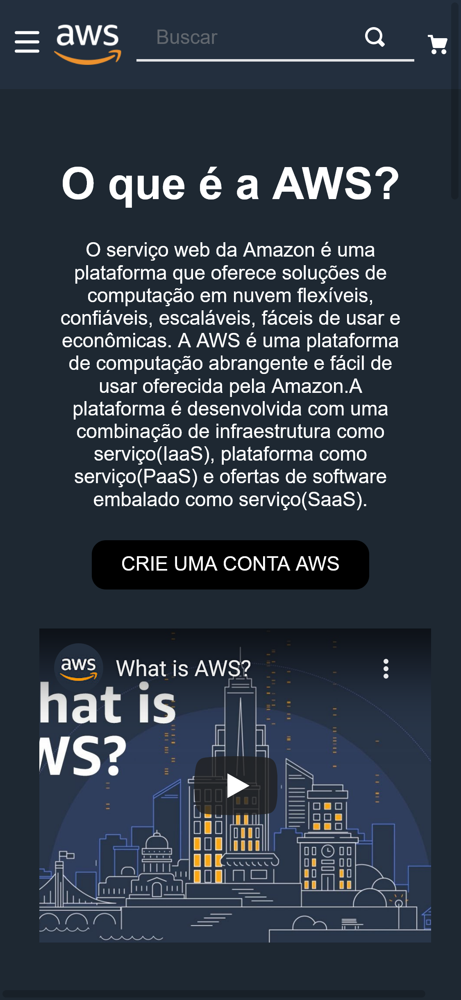

# Tema da loja para Desafio final do programa Hiring Coders

Tema feito a partir do "Minimum Boilerplate Theme" e modificado para que ficasse semelhante a página da Amazon Web Services, AWS.

## 1 - Página inicial

Essa é a página inicial quando se acessa pelo desktop.

### 1.1 - Página inicial Móvel
Esta aqui quando utiliza-se um telefone.

#### 1.1.1 - Menu móvel

### 1.2 - Campo de busca
Quando utiliza-se o campo de pesquisas, resultados aparecem antes da tela final de busca.

#### 1.2.1 - Campo de busca Móvel
Na versão móvel.  

## 2 - Página de buscas
Página de buscas na versão desktop.

### 2.1 - Página de buscas móvel
E aqui na versão móvel.  

## 3 - Carrinho

## 3.1 - Carrinho móvel

## 4 - Página "Sobre"

### 4.1 - Página "Sobre" móvel
 

