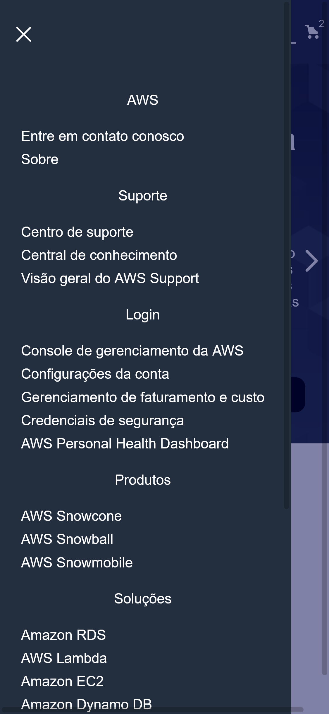
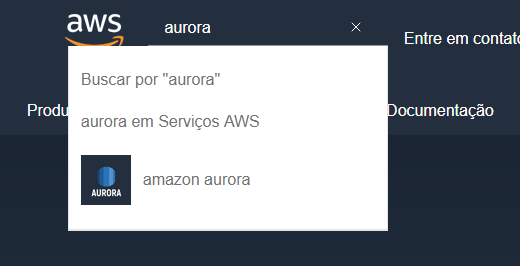
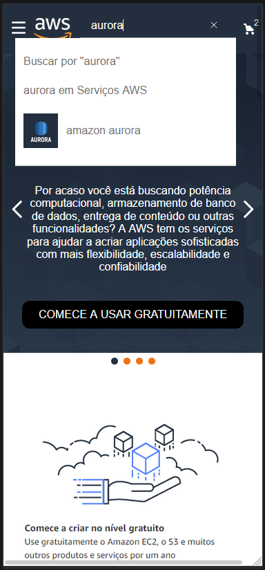
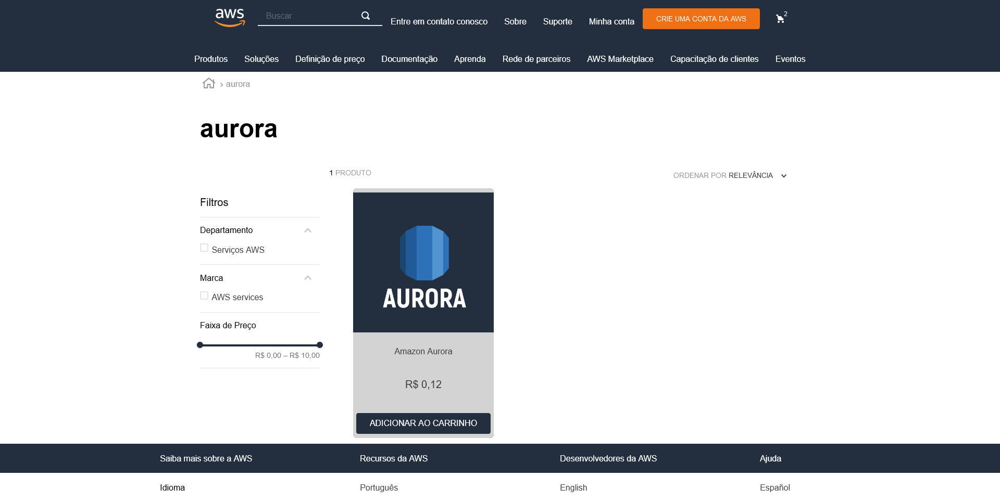
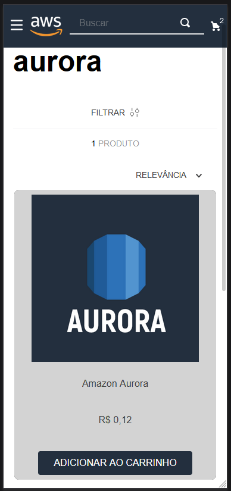

# Tema da loja para Desafio final do programa Hiring Coders

Tema feito a partir do "Minimum Boilerplate Theme" e modificado para que ficasse semelhante a página da Amazon Web Services, AWS.

## 1 - Página inicial

### 1.1 - Página inicial Móvel

#### 1.1.1 - Menu móvel

### 1.2 - Campo de busca

#### 1.2.1 - Campo de busca Móvel

## 2 - Página de buscas

### 2.1 - Página de buscas móvel

## 3 - Página "Sobre"

### 3.1 - Página "Sobre" móvel
 
